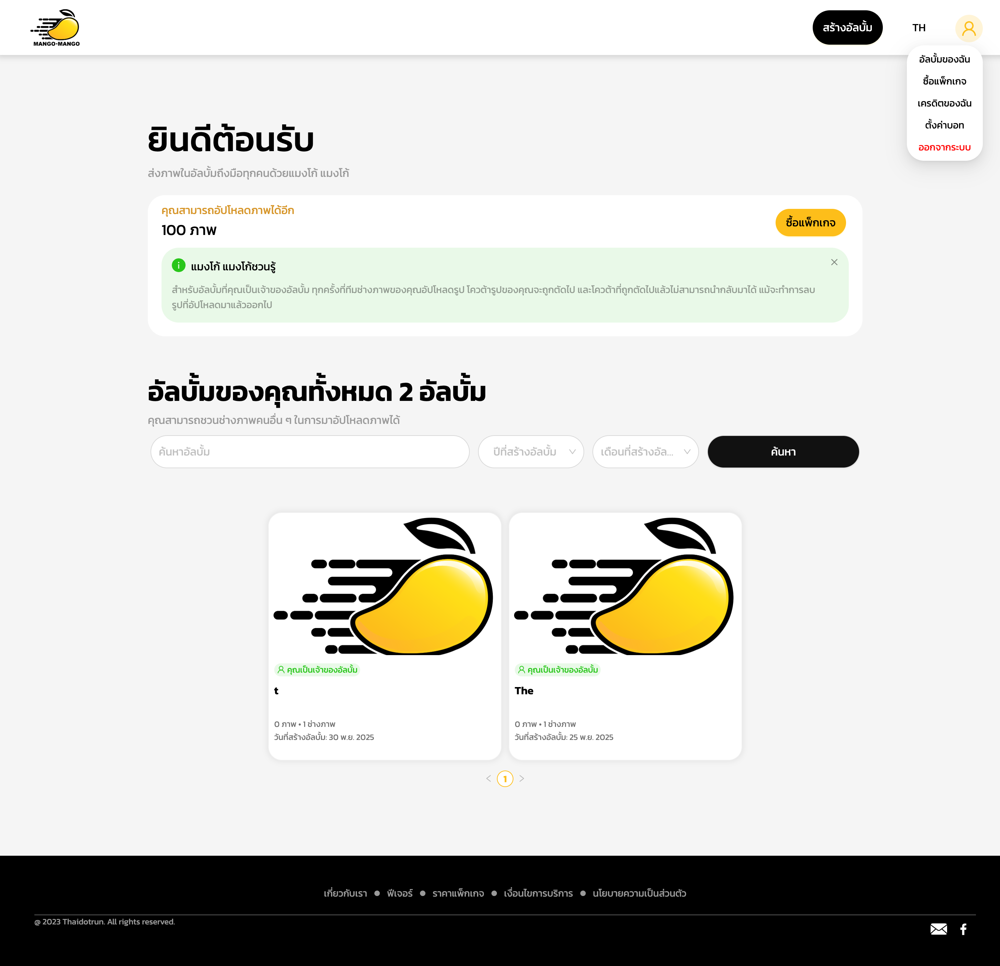
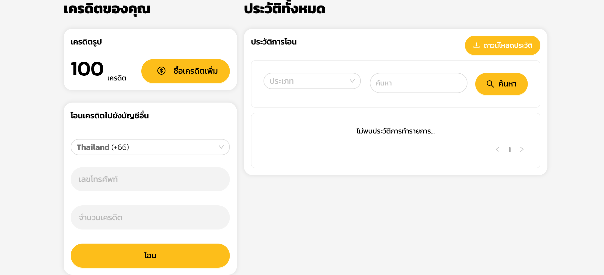
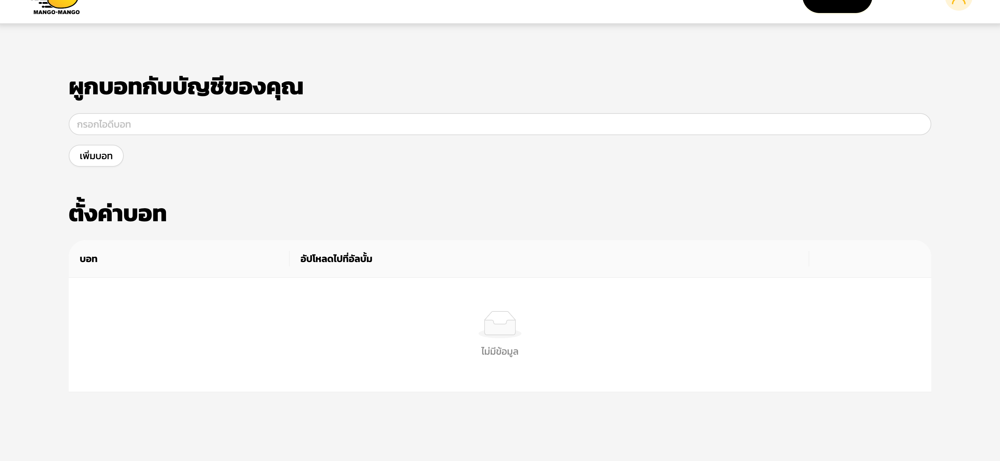
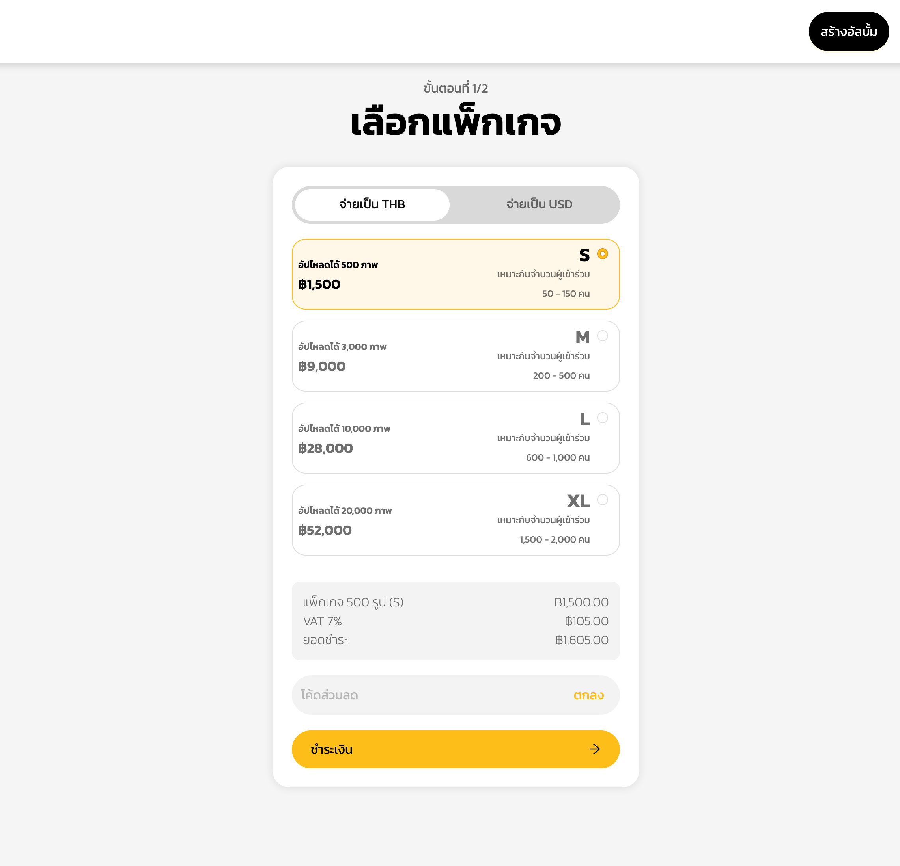
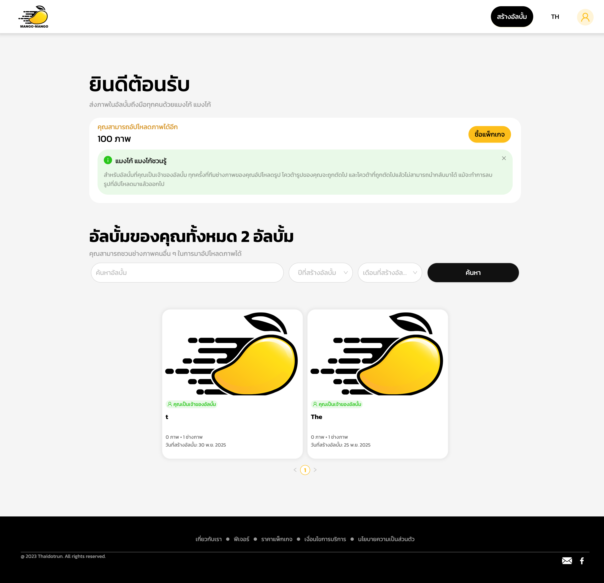
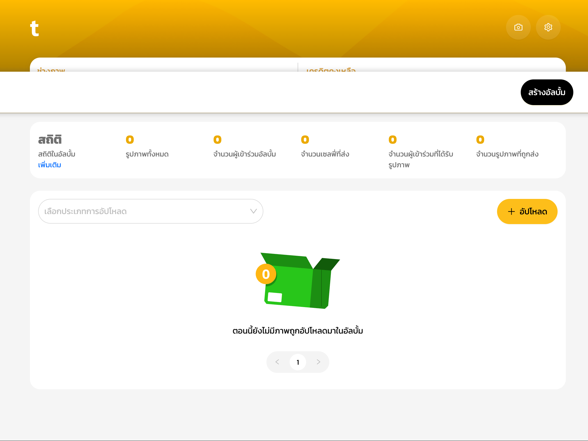
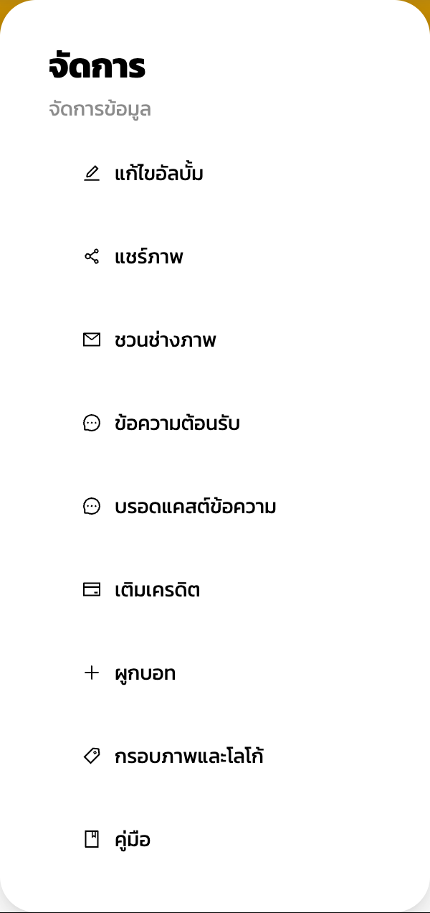
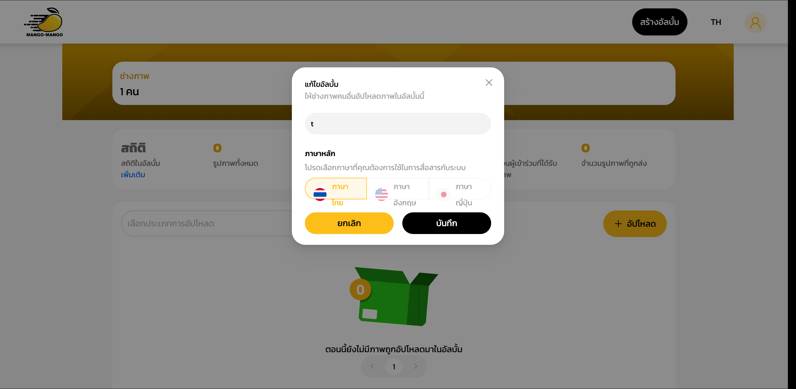
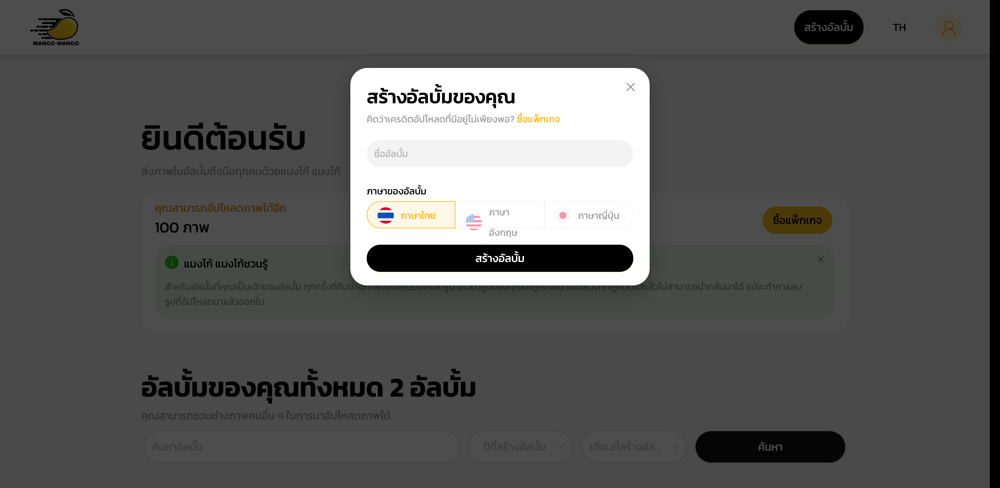

# Mangomango - Dashboard Exploration

## Dashboard Map

### Main Navigation
- **[อัลบั้มของฉัน] (My Albums)** → Main events dashboard showing album overview, quota status, and quick actions
  - Screenshot: 
  - Sub-items: Events list, search/filter, create album, buy package

- **[เครดิตของฉัน] (My Credits)** → Credit management and transfer system
  - Screenshot: 
  - Sub-items: Credit balance, transfer to other accounts, transaction history, download history

- **[ตั้งค่าบอท] (Bot Settings)** → Bot integration and management
  - Screenshot: 
  - Sub-items: Add bot ID, bot assignment to albums

- **[ซื้อแพ็กเกจ] (Buy Package)** → Package purchase and pricing
  - Screenshot: 
  - Sub-items: Package selection (S/M/L/XL), currency choice (THB/USD), payment processing

### All Screens Discovered

| Screen Name | Path to Access | Purpose | Screenshot | Detailed Functionality |
|-------------|----------------|---------|------------|----------------------|
| Events Dashboard | /events | Main overview page showing albums, quota, and quick actions |  | Welcome message with brand tagline "ส่งภาพในอัลบั้มถึงมือทุกคนด้วยแมงโก้ แมงโก้", remaining upload quota display (100 photos), buy package CTA, informational alert about quota deduction, album count (2 albums), search/filter by year/month, album grid with cover images, creation dates, photographer count |
| User Menu with Navigation | User profile click → dropdown | Navigation hub with access to all main sections |  | Dropdown menu with 5 main options: My Albums (อัลบั้มของฉัน), Buy Package (ซื้อแพ็กเกจ), My Credits (เครดิตของฉัน), Bot Settings (ตั้งค่าบอท), Logout (ออกจากระบบ), each with clear icons and Thai/English labels |
| My Credits | /mycredit | Credit balance management and transfer system |  | Credit balance display (100 credits), buy more credits button, transfer credits section with country code dropdown (+66), phone number input, credit amount input, transfer button, transaction history section with download functionality, filter by transaction type, search functionality, empty state for no transaction history |
| Bot Settings | /botmanage | Bot integration configuration for automated uploads |  | Bot ID input field, "Add Bot" button, bot management table showing bot assignments to albums, empty state with "Simple Empty" illustration when no bots configured, clear table structure with columns for bot name and target album |
| Buy Package Step 1 | /credits/buy/step1 | Package selection with pricing and attendee estimates |  | Step indicator (1/2), currency selector (THB/USD with THB default), 4 package tiers: S (500 photos, ฿1,500, 50-150 attendees), M (3,000 photos, ฿9,000, 200-500 attendees), L (10,000 photos, ฿28,000, 600-1,000 attendees), XL (20,000 photos, ฿52,000, 1,500-2,000 attendees), price breakdown with VAT, discount code input, proceed to payment button |
| Event Management | /events/{id}/manage | Individual event management interface |  | Event name header, camera and settings buttons, photographer count (1 person), remaining credits (100), statistics section with links to detailed reports, key metrics (total photos: 0, album participants: 0, selfies submitted: 0, participants who received photos: 0, photos sent: 0), upload section with type selector and upload button, empty state with illustration when no photos uploaded |
| Event Settings Menu | Settings button click → dropdown | Comprehensive event management options |  | Settings menu with 9 options: Edit Album (แก้ไขอัลบั้ม), Share Photos (แชร์ภาพ), Invite Photographers (ชวนช่างภาพ), Welcome Message (ข้อความต้อนรับ), Broadcast Message (บรอดแคสต์ข้อความ), Top Up Credits (เติมเครดิต), Link Bot (ผูกบอท), Photo Frame & Logo (กรอบภาพและโลโก้), Manual (คู่มือ) |
| Edit Album Dialog | Event → Settings → Edit Album | Basic album configuration |  | Album name input field, language selection (Thai, English, Japanese) with radio buttons, instruction text about allowing other photographers to upload, cancel and save buttons, clean modal design |
| Create Album Dialog | Events page → Create Album | New album creation workflow |  | Album name input field, language selection (Thai, English, Japanese), upgrade prompt for insufficient credits, create album button, modal dialog design, appeared twice (possible UI bug) |

### Features Discovered

| Feature | Location | What It Does |
|---------|----------|--------------|
| **Multi-language Support** | Album creation/editing, UI | Thai, English, Japanese language options for albums and interface |
| **Credit-based System** | Dashboard, My Credits, Buy Package | Pay-per-photo upload model with visible quota tracking and bulk package purchasing |
| **Multi-currency Support** | Package Purchase | THB and USD currency options for international users |
| **Credit Transfer System** | My Credits | Transfer credits to other accounts via phone number with country code support |
| **Transaction History** | My Credits | Complete transaction log with search, filtering, and export capabilities |
| **Bot Integration** | Bot Settings, Event Settings | Automated photo upload through bot integration with album assignment |
| **Event Statistics Tracking** | Event Management | Real-time metrics: photos, participants, selfies, delivery rates |
| **Advanced Search & Filtering** | Events Dashboard | Search albums by name, filter by creation year and month |
| **Photographer Collaboration** | Event Settings, Dashboard | Invite multiple photographers to upload to same album |
| **Welcome & Broadcast Messaging** | Event Settings | Custom welcome messages and broadcast messaging capabilities |
| **Photo Sharing System** | Event Settings | Built-in photo sharing functionality (specific workflow unclear) |
| **Package Tier System** | Buy Package | 4-tier package system with attendee count recommendations |
| **VAT Calculation** | Package Purchase | Automatic 7% VAT calculation and display |
| **Discount Code System** | Package Purchase | Promotional code input for package discounts |
| **Visual Branding** | Event Settings | Photo frames and logo customization options |
| **User Documentation** | Event Settings | Built-in manual/help system access |
| **Responsive Empty States** | Multiple screens | Friendly empty state illustrations and messages throughout interface |

### User Flows Observed

**Complete Photographer Workflow:**
1. **Dashboard Check** → Events page → Review remaining credits (100) → Check album count (2)
2. **Event Creation** → Click "สร้างอัลบั้ม" → Enter album name → Select language (Thai/English/Japanese) → Create album
3. **Event Configuration** → Enter event → Click settings → Configure album details → Invite photographers → Set up welcome message → Configure bot integration
4. **Photo Upload** → Event management page → Select upload type → Click "อัปโหลด" → Upload photos (consumes credits)
5. **Team Management** → Event settings → Invite additional photographers via email → Monitor photographer count
6. **Statistics Monitoring** → Event dashboard → Track photo uploads, participants, delivery metrics
7. **Credit Management** → My Credits → Check balance → Transfer credits to team members if needed → Purchase additional credits
8. **Customer Communication** → Event settings → Set welcome message → Send broadcast messages to participants

**Event Creation Flow:**
Step 1: Events page → Click "สร้างอัลบั้ม"
Step 2: Enter album name (required field)
Step 3: Select album language (Thai, English, Japanese - Thai default)
Step 4: Click "สร้างอัลบั้ม" → Album created and added to dashboard
Step 5: Configure settings via settings menu (optional)

**Credit Management Flow:**
Step 1: User menu → "เครดิตของฉัน"
Step 2: View current balance (100 credits shown)
Step 3: Option A: Click "ซื้อเครดิตเพิ่ม" → Navigate to package purchase
Step 4: Option B: Transfer credits → Enter phone number + country code → Enter amount → Click "โอน"
Step 5: View transaction history → Filter by type → Export records if needed

**Bot Integration Flow:**
Step 1: User menu → "ตั้งค่าบอท"
Step 2: Enter Bot ID → Click "เพิ่มบอท"
Step 3: Navigate to specific event → Settings → "ผูกบอท"
Step 4: Assign bot to album for automated uploads

### Observations

**Friction Points:**
- **Credit Anxiety**: Prominent quota display (100 photos remaining) creates constant awareness of consumption and potential additional costs
- **Complex Package Selection**: 4 package tiers require understanding attendee estimates, may overwhelm small event organizers
- **Limited Trial Information**: No clear indication of what users can test without purchasing credits
- **Redundant Dialog Bug**: Create Album dialog appeared twice, indicating UI stability issues
- **Empty State Proliferation**: Multiple screens show empty states (no photos, no transactions, no bots), making platform evaluation difficult
- **Information Alert Density**: Multiple informational messages and alerts compete for attention on main dashboard
- **Mixed Language Navigation**: Thai interface with some English terms may confuse less tech-savvy users
- **Unclear Upload Workflow**: Upload button visible but upload process and supported methods not immediately clear

**Magic Moments:**
- **Simple Album Creation**: Minimal album creation with just name and language selection - removes friction completely
- **Multi-language Native Support**: True multi-language platform (Thai, English, Japanese) not just translation overlay
- **Credit Transfer Flexibility**: Easy credit sharing between accounts via phone number enables team collaboration
- **Automated Bot Integration**: Bot support for automated photo uploads reduces manual workload
- **Real-time Statistics**: Live tracking of photos, participants, and delivery rates provides immediate feedback
- **Collaborative Photographer Model**: Multiple photographers can upload to same album, enabling team coverage
- **VAT Transparency**: Automatic tax calculation and display builds trust in pricing
- **Responsive Empty States**: Friendly illustrations and helpful messages rather than cold "no data" displays
- **Search & Filter Power**: Combined search by name with year/month filtering provides efficient album discovery
- **Mobile-first Design**: Clean, touch-friendly interface elements suggest mobile optimization

**Surprises (Unexpected Features or Missing Expected Features):**
- **Japanese Language Support**: Unexpected Japanese language option alongside Thai and English - suggests broader Asian market focus
- **Phone-based Credit Transfer**: Credit transfer via phone number rather than email or username - mobile-first approach
- **Bot Integration Capability**: Advanced bot integration for automated uploads more sophisticated than expected
- **Package Size Scaling**: Large packages up to 20,000 photos suggests enterprise-scale events beyond typical photography coverage
- **VAT-inclusive Pricing**: Automatic tax calculation suggests professional, business-oriented platform
- **Missing: Watermarking/Branding**: No obvious photo watermarking or branding options in explored screens
- **Missing: Print Integration**: No print ordering or fulfillment services discovered
- **Missing: Social Sharing**: No direct social media integration or sharing options visible
- **Missing: Advanced Analytics**: Limited to basic statistics, no detailed engagement or demographic analytics
- **Missing: Payment Methods**: Package purchase flow not completed, payment method options unclear
- **Missing: User Roles**: No indication of different user roles or permission levels
- **Missing: Album Templates**: No pre-configured album templates or event types discovered
- **Missing: API Access**: No developer tools or API access mentioned in explored sections
