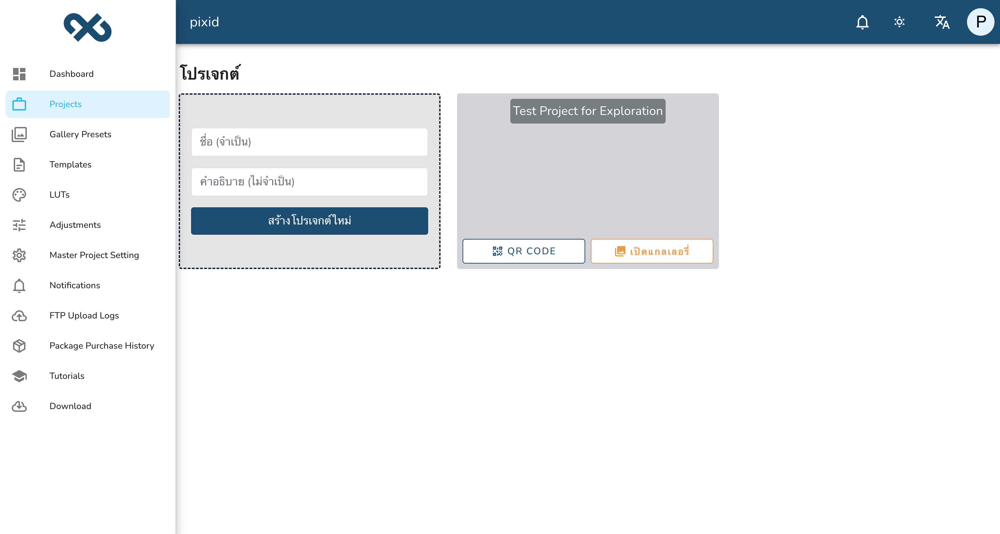
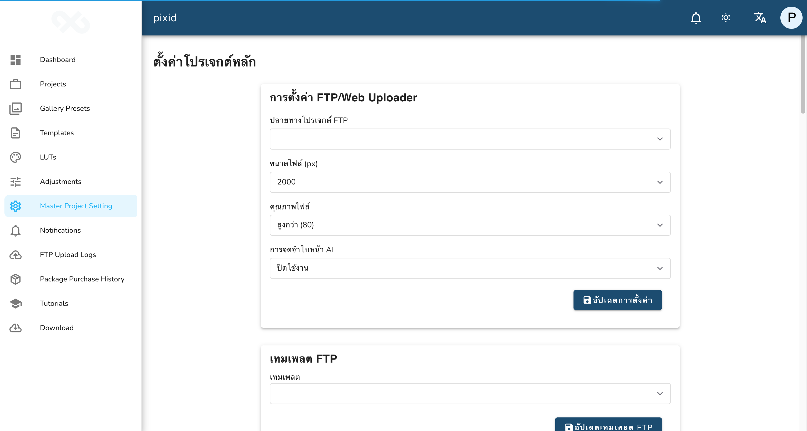
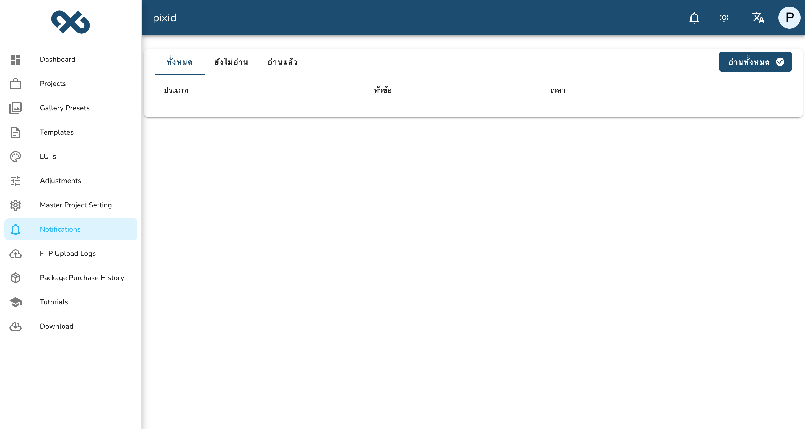
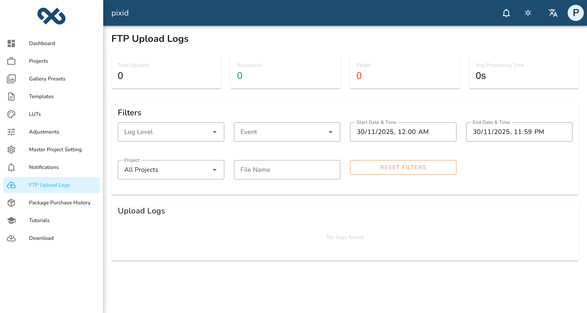
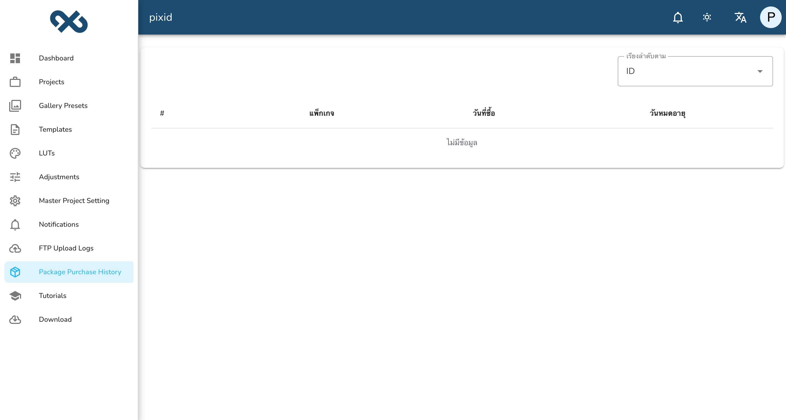
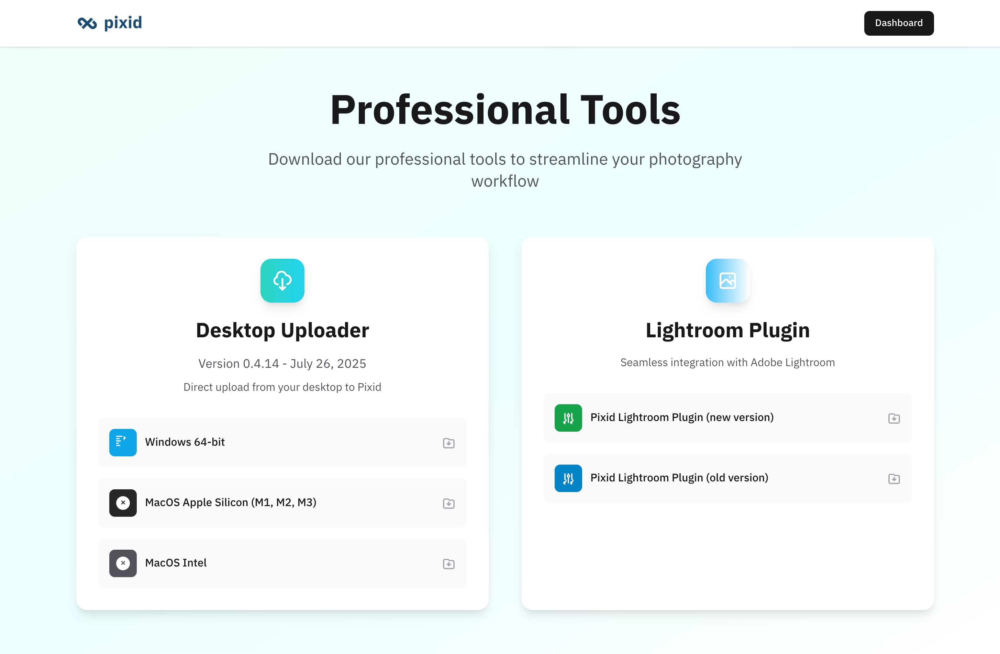

# Pixid - Dashboard Exploration

## Dashboard Map

### Main Navigation
- [Dashboard] → Overview of account status, storage usage, and onboarding guide
  - Screenshot: 
  - Sub-items: Account information, storage tracker, getting started tutorials

- [Projects] → Project creation and management hub
  - Screenshot: , 
  - Sub-items: Create project, project list with QR codes and gallery links

- [Gallery Presets] → Pre-designed gallery themes and templates
  - Screenshot: 
  - Sub-items: 4 preset themes (Midnight, Cube, Gatsby, Sunrise), preview and clone functionality

- [Templates] → Custom frame and watermark template management
  - Screenshot: , 
  - Sub-items: Frame template editor, horizontal/vertical orientation settings

- [LUTs] → Look-Up Table color grading tools
  - Screenshot: 
  - Sub-items: LUT upload/management, real-time testing with intensity control

- [Adjustments] → Photo editing tools and parameter controls
  - Screenshot: 
  - Sub-items: Basic adjustments (exposure, brightness, contrast, saturation), color channel controls, preview system

- [Master Project Setting] → Global configuration and default settings
  - Screenshot: 
  - Sub-items: FTP configuration, image quality settings, AI features, gallery defaults, LINE integration

- [Notifications] → System announcements and user alerts
  - Screenshot: 
  - Sub-items: All/Unread/Read filters, bulk mark as read functionality

- [FTP Upload Logs] → Professional upload monitoring and analytics
  - Screenshot: 
  - Sub-items: Upload statistics, advanced filtering, log level management

- [Package Purchase History] → Subscription and payment tracking
  - Screenshot: 
  - Sub-items: Purchase history table, package expiration tracking

- [Tutorials] → Educational content and workflow guides
  - Screenshot: 
  - Sub-items: Getting started, desktop workflows, mobile/FTP workflows, camera-specific guides

- [Download] → Desktop applications and plugins
  - Screenshot: 
  - Sub-items: Desktop uploader, Lightroom plugin, cross-platform support

### All Screens Discovered

| Screen Name | Path to Access | Purpose | Screenshot | Detailed Functionality |
|-------------|----------------|---------|------------|----------------------|
| Dashboard | /dashboard | Main overview page showing account status, storage usage, and guided onboarding |  | Account overview with package information (free package, no expiration), storage usage tracker (0 MB/200 MB used, 1 project, 0 photos), getting started guide with 4-step tutorial, embedded YouTube tutorial (7 min), FTP account creation button, and usage analytics |
| Projects List | /projects | Central hub for managing photography projects with create/edit/delete capabilities |  | Project management interface with create form (name required, description optional), project list showing test project with QR code and gallery access, successful project creation notifications |
| Projects with Project | /projects (after creation) | Updated project list showing newly created projects with action buttons |  | Dynamic project list displaying created project "Test Project for Exploration" with QR code generation and gallery launch buttons, real-time project creation success feedback |
| Project Detail | /project/19281 | Individual project management screen with upload, editing, and configuration options |  | Comprehensive project workspace with project code (NBSCK), action buttons (upload, moments, download all, clone, quality analysis, recognition, settings), photo management interface with selection controls, tabbed view (Photos), and pagination |
| Upload Interface | /project/19281/upload | Web-based photo upload interface with drag-and-drop functionality |  | Professional upload interface with drag-and-drop zone, upload configuration settings (image size, quality, face recognition settings), real-time upload progress tracking, and warning about web uploader limitations |
| Gallery Presets | /projects/gallery-presets | Pre-designed gallery theme selection and management |  | Gallery theme showcase with 4 available presets (Midnight, Cube, Gatsby, Sunrise), each with preview links and clone functionality, visual thumbnails for theme selection |
| Templates Management | /projects/templates | Custom frame and watermark template creation and editing | ,  | Template creation interface with separate horizontal/vertical frame settings, image size specifications, template naming, search functionality, and table view with create/edit/delete actions |
| LUTs Management | /projects/luts | Look-Up Table color grading tools and testing interface |  | Professional color grading interface with LUT file upload/management, real-time testing with intensity slider (0-100%), sample image upload for testing, searchable LUT library with ID/date tracking |
| Adjustments Editor | /projects/adjustments | Photo editing parameter controls and saved adjustment management |  | Comprehensive photo editing interface with basic adjustments (exposure, brightness, contrast, saturation, hue, fade), individual RGB channel controls, dual slider/numerical input system, saved adjustments library with search, and real-time preview functionality |
| Master Project Settings | /projects/setting | Global platform configuration and default settings management |  | Centralized settings interface with FTP/web uploader configuration (resolution up to 6048px, JPEG quality 20-100%), AI face recognition toggle, template/LUT/adjustment selection, gallery defaults (language, header/logo uploads), and LINE OA integration fields |
| Notifications Center | /notifications | System announcements and user communication hub |  | Professional notification management with tabbed interface (All/Unread/Read), bulk "Mark all as read" functionality, sortable table with Type/Subject/Time columns, currently empty on free account |
| FTP Upload Logs | /projects/ftp-logs | Professional upload monitoring and analytics dashboard |  | Advanced upload monitoring with comprehensive statistics (Total/Successful/Failed uploads, average processing time), sophisticated filtering system (log level, events, date ranges, projects, file names), professional-grade logging for workflow optimization |
| Package Purchase History | /projects/package-history | Subscription and payment transaction tracking |  | Purchase history management with sortable table showing ID, Package, Purchase Date, and Expiration Date columns, clean transaction tracking interface, currently empty on free account |
| Tutorials Library | /projects/tutorials | Educational content and professional workflow guides |  | Extensive tutorial library covering Getting Started (7-min main tutorial), Desktop workflows (Canon EOS Utility, Lightroom plugin with Sony troubleshooting), Mobile/FTP workflows (Nikon, Canon, Sony camera-specific), Universal solutions (PhotoSync), and branding/editing guides |
| Download Center | /projects/download | Desktop applications, plugins, and professional tools |  | Software download center offering Desktop Uploader v0.4.14 (July 2025) for Windows 64-bit, macOS Apple Silicon, and macOS Intel, Lightroom Plugin v0.1.0-beta7 with new/old versions, GitHub-hosted open source tools |

### Features Discovered

| Feature | Location | What It Does |
|---------|----------|--------------|
| **Account Status Tracking** | Dashboard | Shows package information (free), storage usage (0/200 MB), project count (1), photo limits (0/200), expiration status (no expiration) |
| **Guided Onboarding** | Dashboard | 4-step getting started guide with embedded YouTube tutorial, FTP account creation, and usage tracking |
| **Project Management** | Projects | Create projects with name/description, generate QR codes, create gallery links, track project statistics |
| **Web Upload Interface** | Project Upload | Drag-and-drop photo upload with configurable settings (size, quality, face recognition), real-time progress tracking |
| **Gallery Theme System** | Gallery Presets | 4 pre-built gallery themes (Midnight, Cube, Gatsby, Sunrise) with preview and clone functionality |
| **Frame Template Engine** | Templates | Custom frame creation with separate horizontal/vertical settings, image size specifications, template naming |
| **LUT Color Grading** | LUTs | Professional color grading with custom LUT upload, real-time testing with intensity control (0-100%), sample image testing |
| **Photo Adjustment Tools** | Adjustments | Comprehensive editing with basic adjustments (exposure, brightness, contrast, saturation, hue, fade), RGB channel controls, saved adjustment presets |
| **Global Configuration** | Master Project Settings | Platform-wide defaults for FTP uploads, image quality, AI features, gallery settings, multi-language support, LINE OA integration |
| **Professional FTP Workflow** | Multiple sections | FTP-first architecture with account creation, upload logging, monitoring, camera-specific integrations |
| **Upload Analytics** | FTP Upload Logs | Professional monitoring with upload statistics, success/failure rates, processing times, advanced filtering |
| **AI Face Recognition** | Master Settings | Toggle-enabled AI face recognition with integration points in upload workflow |
| **Multi-language Support** | Master Settings | Thai, English, Chinese, Lao language support for gallery interfaces |
| **LINE Integration** | Master Settings | LINE Official Account integration with user ID and access token configuration |
| **Notification System** | Notifications | Professional notification management with type categorization, read/unread states, bulk operations |
| **Educational Resources** | Tutorials | Camera-specific workflow guides (Canon, Nikon, Sony), desktop integration tutorials, mobile workflows |
| **Professional Tools** | Download | Cross-platform desktop uploader, Lightroom plugin, GitHub-hosted open source tools |
| **Quality Control** | Upload Interface | Configurable image resolution (up to 6048px), JPEG quality settings (20-100%), upload validation |
| **Template System** | Multiple sections | Reusable templates for frames, adjustments, and gallery settings for consistent branding |
| **Batch Processing** | Upload/Adjustments | Apply adjustments and settings to entire photo batches during upload workflows |
| **Real-time Preview** | LUTs/Adjustments | Live preview of color grading and adjustments before application to photos |

### User Flows Observed

**Complete Photographer Workflow:**
1. **Dashboard Overview** → Check storage/package status → Review getting started guide → Access tutorials
2. **Project Creation** → Projects → Create Project → Enter project details → Save → Get QR code and gallery link
3. **Upload Configuration** → Master Project Settings → Configure FTP/quality settings → Set templates and adjustments → Enable AI features
4. **Photo Upload** → Project Detail → Upload Tab → Choose upload method (Web/Desktop/FTP) → Configure settings → Upload photos
5. **Photo Enhancement** → Adjustments/LUTs → Apply/edit adjustments → Test with real-time preview → Save as templates
6. **Gallery Setup** → Gallery Presets → Select theme → Clone and customize → Configure language and branding
7. **Quality Assurance** → FTP Upload Logs → Monitor upload success → Review analytics → Troubleshoot issues
8. **Delivery** → Share gallery link/QR code → Configure LINE notifications → Track user engagement

**Project Creation Flow:**
Step 1: Projects → Create New Project
Step 2: Enter project name (required) and description (optional)
Step 3: Save project → Get success confirmation
Step 4: Receive project code (e.g., NBSCK) and QR code
Step 5: Access gallery link for sharing
Step 6: Configure project settings and upload methods

**Professional Upload Workflow (FTP-First):**
Step 1: Master Project Settings → Configure FTP destination and quality settings
Step 2: Download Desktop Uploader or configure camera FTP
Step 3: Set up adjustments/LUTs/templates for batch processing
Step 4: Upload photos via preferred method (Desktop/FTP/Web)
Step 5: Monitor progress via FTP Upload Logs
Step 6: Review results and make final adjustments if needed

**Gallery Customization Workflow:**
Step 1: Gallery Presets → Browse available themes
Step 2: Preview theme functionality (if accessible)
Step 3: Clone selected theme as starting point
Step 4: Templates → Create custom frames/watermarks
Step 5: Adjustments → Configure photo enhancement settings
Step 6: LUTs → Apply color grading if desired
Step 7: Project Settings → Set gallery language and branding

### Observations

**Friction Points:**
- **Free Tier Limitations**: Web uploader "doesn't support LINE Auto," AI face recognition appears disabled in free tier, limited to 200 photos and 200 MB storage
- **Complex Professional Setup**: FTP configuration requires technical knowledge, multiple upload methods create decision complexity, advanced features buried in settings
- **Language Mixed Interface**: Thai and English terms mixed throughout UI, potentially confusing for international users
- **Empty State Handling**: Multiple sections show empty states with minimal guidance, purchase history and notifications empty on free accounts
- **Feature Discovery**: Advanced features scattered across multiple sections, no obvious demo data or sample projects
- **Technical Barriers**: Desktop app download required for full functionality, Lightroom plugin integration needs Adobe software
- **Camera Integration Complexity**: Different setup workflows for Canon/Nikon/Sony cameras create learning curve

**Magic Moments:**
- **Instant QR Code Generation**: Projects immediately get QR codes and gallery links for instant sharing
- **Real-time Preview Testing**: LUTs and adjustments offer live preview with intensity control before application
- **Template Reusability**: Save and reuse adjustments, LUTs, and frame templates for consistent branding across projects
- **Professional FTP Monitoring**: Comprehensive upload analytics with success/failure tracking and processing times
- **Camera-Specific Tutorials**: Extensive manufacturer-specific workflow guides show deep photography expertise
- **Cross-Platform Professional Tools**: Recent updates (July 2025) with Apple Silicon support show active development
- **Immediate Project Creation**: Simple project creation with instant access to all project features
- **Comprehensive Adjustment Controls**: Dual slider/numerical input system provides both visual and precision control

**Surprises (Unexpected Features or Missing Expected Features):**
- **FTP-First Architecture**: Heavy emphasis on FTP workflows rather than modern cloud sync, suggests professional photographer focus
- **Professional Upload Monitoring**: Enterprise-level upload logging and analytics exceeds typical photo sharing platforms
- **Camera Manufacturer Integration**: Specific tutorials and workflows for different camera brands shows deep market knowledge
- **Recent Active Development**: July 2025 version updates and maintained tools indicate ongoing investment
- **Educational Content Depth**: Facebook-hosted user-generated tutorials from working photographers suggests strong community
- **LINE OA Integration**: Deep Thai market integration beyond basic translation, including messaging platform
- **Dual Template Systems**: Separation of gallery presets (design) from templates (branding) shows thoughtful architecture
- **Missing: Mobile App**: No dedicated mobile application, despite mobile workflow tutorials
- **Missing: Social Sharing**: No obvious social media integration beyond gallery links
- **Missing: Collaboration Features**: No team collaboration or multi-user access controls visible
- **Missing: Advanced Search**: No face search or advanced photo discovery features despite AI capabilities
- **Missing: E-commerce Integration**: No built-in photo sales or payment processing features
- **Missing: API Access**: No developer tools or API integration despite professional feature set