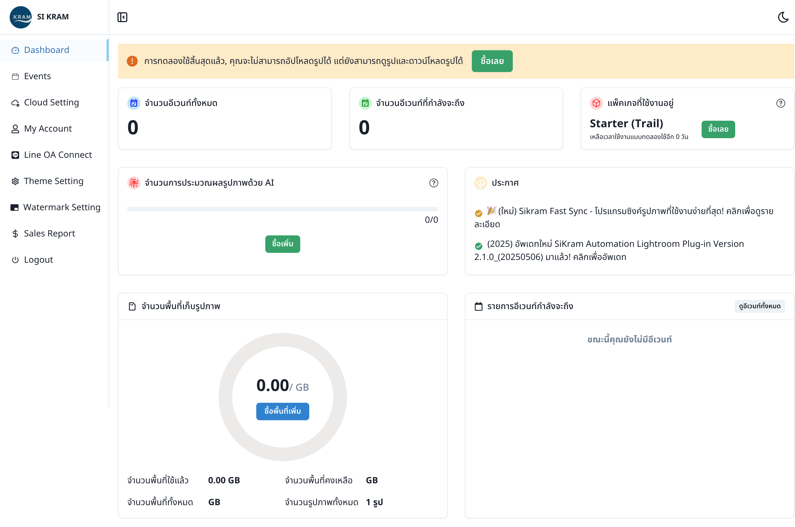
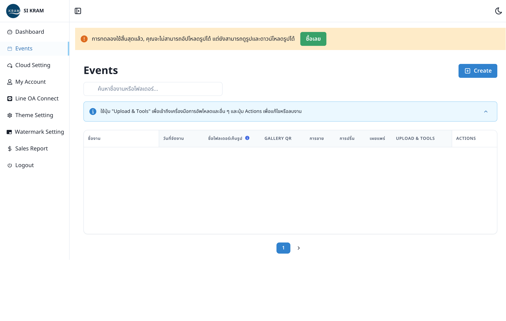
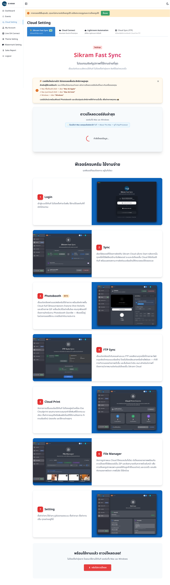
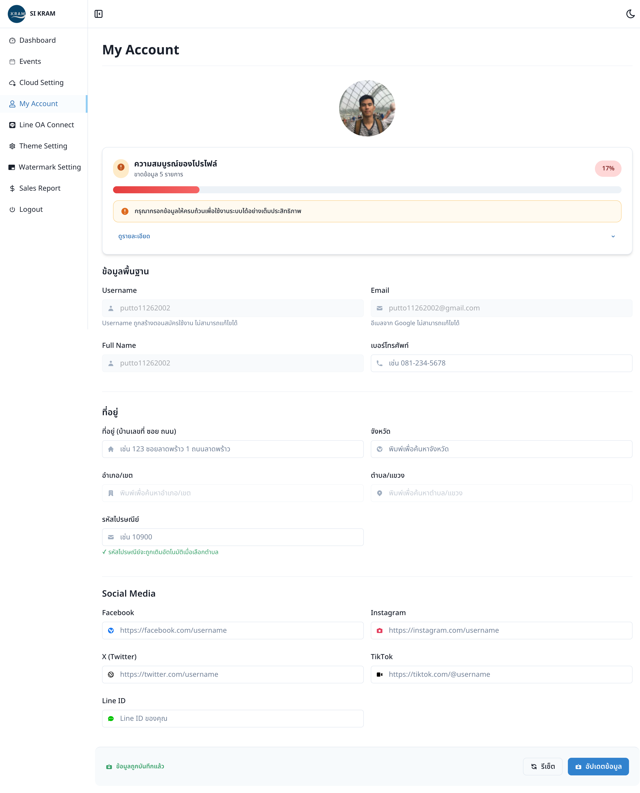
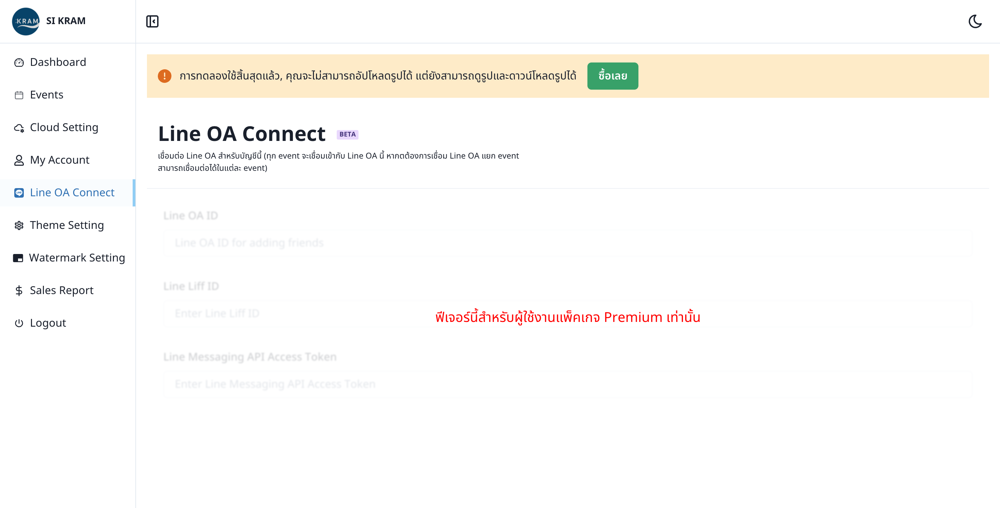
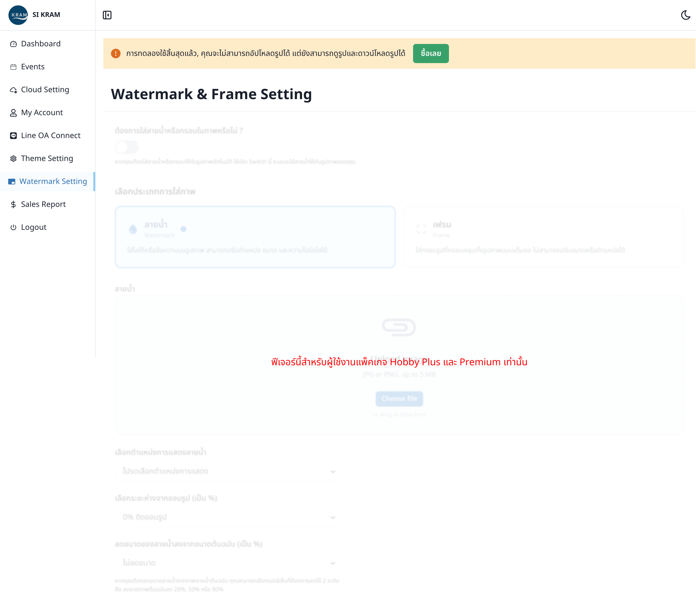
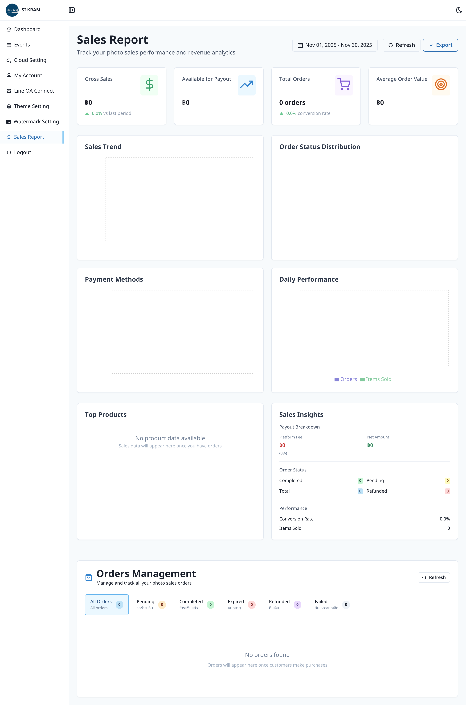

# SiKram - Dashboard Exploration

## Dashboard Map

### Main Navigation
- [Dashboard] → Overview of account status, storage usage, and key metrics
  - Screenshot: 
  - Sub-items: Account statistics, storage tracker, announcements

- [Events] → Event creation and management hub
  - Screenshot: 
  - Sub-items: Create Event, Event List with search/filter, Event Actions

- [Cloud Setting] → Photo upload synchronization configuration
  - Screenshot: 
  - Sub-items: Sikram Fast Sync, Cloud Connect, Lightroom Automation, Cloud Sync (FTP)

- [My Account] → User profile and account management
  - Screenshot: 
  - Sub-items: Profile Information, Address, Social Media Links

- [Line OA Connect] → LINE Official Account integration setup
  - Screenshot: 
  - Sub-items: LINE OA Configuration, LIFF Setup, API Access

- [Theme Setting] → Visual appearance customization
  - Screenshot: 
  - Sub-items: Color customization, Logo upload

- [Watermark Setting] → Branding and photo protection configuration
  - Screenshot: 
  - Sub-items: Watermark vs Frame, Position settings, Upload options

- [Sales Report] → Revenue and performance analytics
  - Screenshot: 
  - Sub-items: Date range selection, Export functionality

### All Screens Discovered

| Screen Name | Path to Access | Purpose | Screenshot | Detailed Functionality |
|-------------|----------------|---------|------------|----------------------|
| Dashboard | /dashboard | Main overview page showing account status, storage usage, and key metrics |  | Account overview with trial expiration countdown, package tier display (Starter/Premium), storage usage with visual progress bars, event statistics (total/upcoming events), AI processing metrics with upgrade prompts, announcements/news feed, and prominent upgrade CTAs |
| Events List | /events | Central hub for managing all photography events with create/edit/delete capabilities |  | Event management interface with searchable table showing event name, date, storage folder, QR codes, sales/print/publication status, trial limitation alerts, "Upload & Tools" buttons, and "Actions" menu for edit/delete operations |
| Event Creation | /events/create | Comprehensive event setup with basic settings, advanced options, and premium features |  | Multi-step event creation wizard with required fields (name, date, folder), optional details (subtitle, description), language selection (Thai/English/Chinese/Lao), display options (gallery visibility, menu bar), advanced capture settings (Face Capture Mode, Pic Guard AI quality filter), and premium feature gates (registration, themes, Line OA, print, sales) |
| Cloud Settings | /cloud-setting | Configure photo synchronization methods (Fast Sync, Cloud Connect, Lightroom, FTP) |  | Tabbed synchronization interface with 4 methods: 1) Sikram Fast Sync (zero-setup desktop app with photobooth integration, face search, FTP sync, cloud print, file manager), 2) Cloud Connect (Mountain Duck + PhotoSync web-based), 3) Lightroom Automation (Adobe plugin), 4) Cloud Sync FTP (direct camera-to-cloud transfer) |
| My Account | /my-account | User profile management with personal info, address, and social media integration |  | Profile completion tracker (17% shown), personal information fields (username/email locked, phone editable), Thai address system with province/district/sub-district cascading dropdowns, social media integration (Facebook, Instagram, X/Twitter, TikTok, Line ID), profile photo upload, and save/reset controls |
| Line OA Connect | /line-oa-connect | LINE Official Account integration setup for messaging and notifications |  | LINE OA configuration with beta label, setup for account-level or event-specific connections, input fields for LINE OA ID, LINE LIFF ID, and Messaging API Access Token, with premium feature requirement notice |
| Theme Settings | /theme-setting | Visual appearance customization including colors and logo (Premium feature) |  | Premium theme customization with color picker (hex input), hue adjustment sliders, text color selection, logo upload interface (drag & drop or click), reset buttons, and premium feature restriction notice for Hobby Plus and Premium users |
| Watermark Settings | /watermark-setting | Configure watermarks and frames for photo branding (Premium feature) |  | Premium watermark/frame configuration with toggle enable switch, watermark vs frame selection, image upload (JPG/PNG up to 5MB), positioning controls (5 corners + center), distance from edge percentage (1-10%), size reduction percentage (10-90%), and premium feature restriction notice |
| Sales Report | /sales-report | Analytics and revenue tracking for photo sales performance |  | Sales analytics dashboard with date range selector (All Time/7 days/30 days/3 months/1 year), empty state messaging ("No sales records found"), export report functionality, navigation sidebar showing premium feature markers, and bilingual interface (Thai/English) |

### Features Discovered

| Feature | Location | What It Does |
|---------|----------|--------------|
| **Account Status Tracking** | Dashboard | Shows trial expiration, package information (Starter/Premium), upgrade prompts |
| **Event Statistics** | Dashboard | Displays total events count, upcoming events, storage usage with visual progress bars |
| **AI Processing Metrics** | Dashboard | Shows photo processing usage (0/0 in current state) with purchase options |
| **Announcements System** | Dashboard | News feed for product updates, new features, and version releases |
| **Event Management** | Events | Create, edit, delete events with comprehensive settings and metadata |
| **Multi-language Support** | Event Creation | Thai, English, Chinese, Lao language options for events |
| **Advanced Display Options** | Event Creation | Control gallery visibility, menu bar, original image display, event card customization |
| **Pic Guard Quality Filter** | Event Creation | Automatic filtering of blurry/closed-eye images using AI |
| **Face Capture Mode** | Event Creation | Mobile guest camera functionality for participant photos |
| **Sikram Fast Sync** | Cloud Settings | Desktop application for zero-setup automatic photo synchronization |
| **Photobooth Integration** | Cloud Settings | Built-in photo booth capabilities in the Fast Sync application |
| **Face Search** | Cloud Settings | Advanced file manager with facial recognition search capabilities |
| **FTP Direct Sync** | Cloud Settings | Real-time file transfer directly from cameras to cloud storage |
| **Lightroom Plugin** | Cloud Settings | Adobe Lightroom integration for automated workflow |
| **Profile Completion** | My Account | Visual tracker for profile completeness (17% shown) with required/optional fields |
| **Geographic Data** | My Account | Thai address system with province/district/sub-district dropdowns |
| **Social Media Integration** | My Account | Facebook, Instagram, X/Twitter, TikTok, Line ID profile links |
| **LINE OA Integration** | Line OA Connect | Official Account messaging and notification system |
| **Theme Customization** | Theme Settings | Color selection with hex input, logo upload, brand consistency |
| **Watermark Configuration** | Watermark Settings | Image upload, positioning (5 locations + center), size and distance controls |
| **Frame Options** | Watermark Settings | Full-frame branding alternative to watermark overlay |
| **Sales Analytics** | Sales Report | Date range selection, revenue tracking, export capabilities |
| **Print Management** | Events (Premium) | Integrated print ordering and fulfillment system |
| **Photo Sales** | Events (Premium) | Built-in e-commerce for photo downloads and prints |
| **Event Registration** | Events (Premium) | Attendee registration and data collection system |

### User Flows Observed

**Complete Photographer Workflow:**
1. **Account Setup** → My Account → Complete profile (17% completion shown) → Add social media links
2. **Dashboard Check** → Dashboard → Review storage/package status → Check AI processing limits
3. **Event Creation** → Events → Create Event → Fill basic info (name, date, folder) → Configure language/display → Set advanced options → Publish
4. **Upload Configuration** → Cloud Settings → Choose sync method (Fast Sync recommended) → Install desktop app → Connect folder
5. **Branding Setup** (Premium) → Theme Settings → Set colors/logo → Watermark Settings → Configure watermark/frames
6. **Photo Management** → Fast Sync app → Automatic upload → Face search → Quality filtering
7. **Event Management** → Events → Monitor upload progress → Configure gallery settings → Set pricing (Premium)
8. **Sales & Analytics** → Sales Report → Track performance → Export data

**Event Creation Flow:**
Step 1: Events → Create Event
Step 2: Basic Information (Event name, date, storage folder - all required)
Step 3: Event Details (Subtitle, description - optional)
Step 4: Language Selection (Thai, English, Chinese, Lao)
Step 5: Display Configuration (Gallery visibility, menu bar, original images)
Step 6: Advanced Features (Face capture, Pic Guard quality filtering)
Step 7: Premium Features (Registration, themes, Line OA, print, sales)
Step 8: Event Card Customization → Save Event

**Photo Upload Workflow (Fast Sync Recommended):**
Step 1: Cloud Settings → Sikram Fast Sync Tab
Step 2: Download appropriate app (Mac/Windows)
Step 3: Login with existing credentials (no setup required)
Step 4: Select folders for automatic monitoring
Step 5: Real-time upload to cloud with face detection
Step 6: Access via file manager with search capabilities

### Observations

**Friction Points:**
- **Trial Limitations Prominent**: "Cannot upload photos" alert blocks core functionality, forcing upgrade decision
- **Premium Feature Walls**: Advanced features (themes, watermarks, Line OA, print, sales) require Premium upgrade
- **Complex Event Creation**: Long form with multiple sections could overwhelm new users
- **Multiple Sync Options**: 4 different upload methods (Fast Sync, Cloud Connect, Lightroom, FTP) creates decision fatigue
- **Technical Setup Required**: Mountain Duck and FTP configurations need technical knowledge
- **Profile Completion Pressure**: 17% completion score creates psychological pressure to add more information
- **Mixed Language Interface**: Thai and English terms mixed throughout UI
- **Empty State Handling**: Multiple "Loading..." states and no data displays make evaluation difficult

**Magic Moments:**
- **Zero Setup Sync**: Sikram Fast Sync promises "Login and use immediately" - removes friction completely
- **Real-time Automation**: Automatic folder monitoring and upload without manual intervention
- **AI Quality Filtering**: Pic Guard automatically removes blurry/poor quality photos - saves manual curation time
- **Face Recognition Search**: Advanced file manager with facial detection - powerful for large events
- **Photobooth Integration**: Built-in photo booth capabilities in desktop app - additional revenue stream
- **All-in-One Platform**: Complete workflow from capture to sales in single system
- **Multi-language Support**: Native support for Thai market and regional languages
- **Professional Print Integration**: Cloud-based print ordering and fulfillment
- **Social Media Ready**: Easy linking to photographer's social media presence

**Surprises (Unexpected Features or Missing Expected Features):**
- **Built-in Photo Booth**: Desktop app includes photobooth functionality - unexpected value-add
- **Regional Focus**: Deep Thai address system integration and language support beyond basic translation
- **Advanced AI Features**: Face recognition and quality filtering more sophisticated than expected
- **Comprehensive Analytics**: Full sales reporting and export capabilities
- **Mobile Guest Camera**: Face capture mode for attendees to take their own photos
- **Professional Integrations**: Adobe Lightroom plugin and direct FTP from cameras
- **Flexible Sync Options**: Multiple upload methods catering to different technical skill levels
- **Social Commerce Integration**: Direct social media profile linking for photographer credibility
- **Print Fulfillment**: Complete print ordering system, not just digital downloads
- **LINE OA Integration**: Deep messaging platform integration for Asian markets
- **Missing: Trial Extension**: No obvious way to extend trial or get temporary access for evaluation
- **Missing: Help Documentation**: No visible help system or documentation links during exploration
- **Missing: Demo Data**: No sample events or photos to demonstrate functionality in empty state